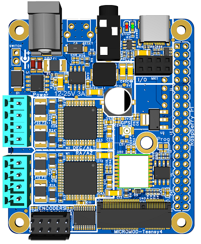
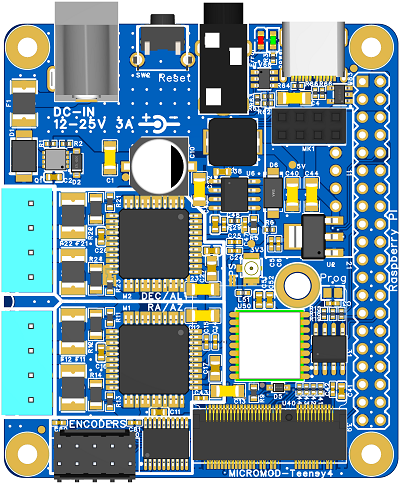

# TeenAstro v3

## 2 ans plus tard, on en est où ?
7 versions fabriquées, plein de blocs logiques testés (driver moteur, alim ...), plusieurs form factors essayés, du plein format raspberry PI à la boite de tic-tac

Rien n'était pleinement satisfaisant, trop grand, pas adapté pour rentrer dans un boitier, trop compliqué à assembler ... mais on s'approche d'un truc bien (les 2 dernières à droite)

Puis est arrivé la Révolution : les [**MicroMod Sparkfun**](https://www.sparkfun.com/micromod).

 

un format standardisé de micro-controleurs dispo en plusieurs diversités (STM32, teensy, esp32 ...) avec un connecteur commun (M.2, le connecteur des cartes wi-fi de portables et des SSD)

ça supprime la principale contrainte du teensy : les pins traversants qui empèche de faire une carte CMS propre

nouveau design autour de ce nouveau teensy

tous les autres blocs ont été testé et validé sur les différents proto (sauf le GPS intégré, mais il y a un failsafe apour un module standard si les perfs ne sont pas au rendez-vous)

### Points clés

- #### Carte CMS livrée assemblée à 90+ %
	c'est l'objectif depuis le début : proposer un design CMS tout intégré et assemblé en usine (chez JLCpcb). Pour réduire la barrière de la soudure des composants, le casse-tête du sourcing ...

- #### Teensy 4 M.2
	Nouvelle version dev par sparkfun (en collab avec PJRC)

	46 I/O, 5 UART ...

	le schéma est compatible avec le Teensy 4.1 (42 GPIO accessibles directement)
	
- #### driver moteur TMC2660
	plus performant que les 2130, moins cher que les 5160
	
	interface hard et soft identique (juste à mettre à jour le constructeur)
	
	MOSFET intégrés jsuqu'à 2.8A (protégé par des polyfuses 3A)

- #### entrées pour des encodeurs ABN
	le teensy 4 a  un **module hardware** de gestion des encodeurs, et des libraires fournissent des méthodes toutes prètes pour les utiliser

- #### Connecteur USB-C
	c'est moderne, c'est robuste et c'est devenu le standard, tout le monde commence à avoir un cable USB-C chez lui

	uniquement utilisé pour la connexion au PC, ne gère pas l'alim (Power Delivery)

- #### module GPS intégré
	prévu en test sur le prochain proto, un module chinois intégré sur la carte, pour ne plus se poser la question duquel acheter parmi les 300 réfs de aliexpress

	en plan B, header pour un neo-6/7/8 classique

- #### alim
	supporte jusqu'à 25V

	pensé pour être relié à une batterie de visseuse (20V Li-Ion)

- #### port ST4
	dispo uniquement sur la Mini Classic

	les résistances de pull-up sont toujours présentes sur les 2 autres cartes, pour la compatibilité du firmware

### Versions Mini

[Description détaillée](TeenAstro_v3.0_schematics.md), [Schéma complet ](TeenAstro_v3.0_Mini_Schematics.pdf) en PDF et page par page ([Teensy](TeenAstro_v3.0_Mini-Motors.png), [Power](TeenAstro_v3.0_Mini-Power.png) et [Moteurs](TeenAstro_v3.0_Mini-Teensy.png)) en png

- #### Version Mini-HAT

HAT : Hardware Attached on Top -> carte montée au dessus

format standardisé d'extension pour micro-controleur (avec chacun ses specs) : arduino, PI, ESP ...

respecte les specs de la fondation PI pour les HAT

	- EEPROM d'auto-config du PI (GPIO et overlays)
	- protection de l'alimentation (évite les conflits si le PI est déjà alimenté)
	- format de la carte standard à tous les HAT

principal intéret : communication directe entre le teenastro et le pi via les pins GPIO (UART_1), libère un USB sur le pi

compatible avec la plupart des boitiers PI (qui exposent les GPIO, bien sur)

- #### Version Mini Redux

**design à terminer**

La version mini de la Mini

prévu pour un boitier alu extrudé [Farnell](https://fr.farnell.com/multicomp/mc002185/coffret-usage-multiple-alum-noir/dp/2830518) ou intégration directement dans la monture (impression 3D)

- #### version Mini Classic

* Format identique à la Mini 2.4 (les facades sont à retoucher)

* pour une upgrade à moindre frais vers le teensy 4 + encodeurs

#### BOM additionnelle

* Teensy MicroMod [digikey](https://www.digikey.fr/fr/products/detail/sparkfun-electronics/DEV-16402/13282889)
* DC-in avec switch intégré [glissière](https://www.digikey.fr/fr/products/detail/adafruit-industries-llc/3642/8346573) ou [bascule](https://www.digikey.fr/fr/products/detail/adafruit-industries-llc/3643/8346574)
* jack 3.5mm 4 points [Farnell](https://fr.farnell.com/multicomp/mc001293/connecteur-audio-jack-4-voies/dp/2613990?MER=sy-me-pd-mi-alte)
* connecteur 4P 3.5mm x2 
	* [version droite](https://fr.farnell.com/multicomp/mc000082/embase-3-5mm-vertical-12a-04-voies/dp/2008057?MER=sy-me-pd-mi-acce)
	* [version coudée}](https://fr.farnell.com/amphenol-fci/20020110-c041a01lf/terminal-block-pluggable-4-position/dp/1787818?MER=sy-me-pd-mi-alte)
	* [connecteur droit](https://fr.farnell.com/multicomp/mc000066/fiche-3-5mm-coude-10a-04-voies/dp/2008039?MER=sy-me-pd-mi-acce)
	* [connecteur coudé](https://fr.farnell.com/multicomp/mc000058/fiche-3-5mm-droit-10a-04-voies/dp/2008030?MER=sy-me-pd-mi-acce)
	* [bornier à vis](https://fr.farnell.com/molex/39357-0004/bornier-fil-a-carte-4-voies-16awg/dp/3863541?MER=sy-me-pd-mi-alte)
* Header à broches 2x5pts 2.54m male [Farnell](https://fr.farnell.com/multicomp/2213s-10g/embase-male-2-rangee-vert-10voies/dp/1593442)
* header à broches 2x4pts 2.54mm femelle [Farnell](https://fr.farnell.com/multicomp/2214s-08sg-85/fiche-femelle-ci-2-rangee-vert/dp/1593489)
* micro-switch 90° [Farnell](https://fr.farnell.com/c-k-components/pts645vh58-2lfs/commutateur-spst-0-05a-12vdc-tht/dp/2320088)
* plot à souder 2.5mm H: 4.8mm [Farnell](https://fr.farnell.com/wurth-elektronik/9774050151r/entretoise-ronde-cms-acier-m2/dp/2497604)
* batterie LM1220
* antenne GPS

panier farnell : 

### Evolution du soft

- modif du pinout
- gestion des TMC2660 à peaufiner
- ajout de la gestion des encodeurs (lib existantes)
- ajouter une option dans le menu pour désactiver les moteurs, pour permettre les mouvements manuels sur un dobson sans débrayage mécanique (push-to avec les encodeurs)
- gerer plusieurs profils de télescope directement depuis la raquette, à la manière des sites
- ajout d'une option pour choisir le mode de connexion au PC : usb ou UART directe

### prix de revient 

Avec les 2 drivers moteurs, le GPS et tous les composants CMS assemblés

* par lot de 5 : **50€**

* par lot de 25 : **35€**

#### Composants à rajouter

	- connecteurs moteur (bornier à vis)
	- headers
	- Teensy M.2 (25-30€)
	- téléco
	- pile rechargeable LM1220
	- header 40pts (HAT)